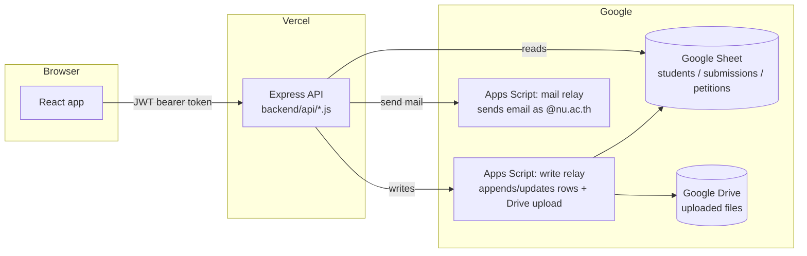

# SCiUSNU Smart

Web app for managing senior/research project submissions, advisor approvals, and online petitions (แบบคำร้อง) for the Faculty of Science student union workflow at Naresuan University (`@nu.ac.th`).

**Live:** https://sciusnu-smart.vercel.app

> 📌 If you're a developer picking this project up from someone else, skip straight to **["For the Next Developer"](#for-the-next-developer)** near the bottom — that section is written for you.

---

## What this app does

- **Project submission pipeline** — students upload proposals, progress reports, and final reports (โครงร่าง / รายงานความก้าวหน้า / รายงานฉบับสมบูรณ์); advisors and co-advisors review and approve/reject with a reason.
- **Online petitions** — students submit a แบบคำร้อง that routes through a multi-step approval chain (student(s) → advisor → school advisor), each step signed with an on-screen signature pad. Approvers who aren't logged in can approve via a one-time magic link sent by email.
- **Admin controls** — open/close submission windows by date, manage settings, view everything.
- **File storage** — uploads go to Google Drive, not the app server.
- **No traditional database** — Google Sheets is the system of record; reads go straight to the Sheets API, writes go through a Google Apps Script relay (Sheets API alone can't easily append/update with the validation this app needs, and the relay also handles Drive uploads + email).

## Roles

| Role | Where it comes from | Dashboard |
|---|---|---|
| `student` | row in the main sheet | `StudentDashboard` |
| `advisor_main` | advisor email/password in sheet | `AdvisorDashboard` (full review rights) |
| `advisor` | co-advisor email/password in sheet | `ViewerDashboard` (review rights) |
| `viewer` | school-advisor email/password in sheet | `ViewerDashboard` (review rights) |
| `admin` | `ADMIN_USERNAME` / `ADMIN_PASSWORD` env vars | `AdminDashboard` |

Role is decided **server-side** at login and embedded in a signed JWT — the frontend never gets to choose its own role (see [Security notes](#security-notes)).

## Tech stack

| Layer | Tech |
|---|---|
| Frontend | React 19 + TypeScript + Vite, Tailwind CSS v4, Zustand (state), React Router |
| Backend | Express 5, deployed as Vercel functions (`backend/api/*.js`) |
| Auth | JWT (`jsonwebtoken`), credentials checked against sheet rows |
| Data store | Google Sheets (via `googleapis`), read-cached in-process |
| Writes / Drive / Email | Google Apps Script web apps acting as a relay (two separate deployments) |
| Hosting | Vercel (frontend + backend together, see `vercel.json`) |

## How it's wired together



**Why this shape:** a Google Service Account can *read* Sheets directly, but writing safely (with row-locking/validation) and uploading to Drive needed Apps Script running as the actual `@nu.ac.th` account. Same story for email — Workspace accounts here don't support SMTP app passwords, so `MailApp.sendEmail()` inside Apps Script is the workaround.

## Project structure

```
backend/
  api/        one file per HTTP endpoint (Vercel function convention)
  lib/        shared logic: auth, sheets, drive, mail, settings, caching
  server.js   local Express entry point (mounts the same api/ handlers)
mail-relay/   Google Apps Script source (Code.gs/router.gs/petitions.gs/helpers.gs) —
              copy-pasted into the Apps Script editor, NOT deployed from here
oldcode/      legacy pre-React single-file HTML dashboards (gitignored, kept for
              reference only — see handoff notes below)
src/
  pages/      one file per dashboard (Student/Advisor/Viewer/Admin/Login/Petition)
  components/ shared + petition + auth + layout components
  services/   api.ts (REST client), petitionApi.ts
  store/      authStore.ts (Zustand)
  types/      shared TS types, derived from sheet columns
```

## Getting started locally

### Prerequisites
- Node.js 20+
- Access to the project's Google Sheet, Service Account JSON, and the two Apps Script deployment URLs

### 1. Install
```bash
npm install                  # frontend deps
cd backend && npm install    # backend deps
```

### 2. Configure environment
Copy `.env.example` to `.env` (project root, used by the frontend dev proxy) **and** to `backend/.env`, then fill in real values. At minimum you need:

- `JWT_SECRET`, `JWT_EXPIRES_IN`
- `ADMIN_USERNAME`, `ADMIN_PASSWORD`
- `SPREADSHEET_ID`, `GS_MAIN_TABLE_NAME`, `GOOGLE_SERVICE_ACCOUNT_JSON`
- `APPS_SCRIPT_URL` + `APPS_SCRIPT_SECRET` (write relay)
- `MAIL_RELAY_URL` + `MAIL_RELAY_SECRET` (mail relay)
- `DRIVE_FOLDER_ID`, `UPLOAD_TOKEN_SECRET`, `SIGNATURE_KEY`
- `ADMIN_EMAILS`, `WEB_URL`

Frontend also reads `VITE_API_URL` (point it at your local backend, e.g. `http://localhost:3000`, or leave blank to call same-origin in prod).

### 3. Run
```bash
# terminal 1
cd backend && npm run dev     # nodemon, http://localhost:3000

# terminal 2
npm run dev                   # vite, http://localhost:5173
```

## Deployment

- Hosted on Vercel; `vercel.json` builds the Vite frontend and the `backend/` Express app as separate services under one project. Push to `main` → auto-deploy.
- The two Apps Script projects (write relay, mail relay) are **not** deployed from this repo or from Vercel. They live in the Google account's Apps Script editor — source is kept here under `mail-relay/` for version control, but changes have to be manually copy-pasted into the Apps Script editor and redeployed as a new web app version. This is the part most likely to surprise a new developer.
- All secrets are set in Vercel → Project → Settings → Environment Variables (see `.env.example`).

## Security notes

The codebase has comments tagged `FIX Vuln N` marking a security-hardening pass that's already been done — e.g. role is always derived from the server-signed JWT (never trusted from the client), sensitive auth state isn't persisted to `localStorage`, logout revokes the JWT server-side, Drive links are validated against an allowlist of Google domains, a CSP is set in `index.html`. **Read these comments before touching auth, file URLs, or token handling** so you don't accidentally reopen something that was deliberately closed.

---

## For the Next Developer

This project has had a single maintainer so far. If you're inheriting it, here's the honest state of things.

### What's solid
- Auth/role handling and the Drive-URL allowlist have been through an explicit security pass (see above) — don't need a rewrite, just respect the existing pattern.
- The submission and petition workflows are feature-complete and in production use.

### What needs attention
- **No automated tests, no CI.** Changes are verified manually. If you have time, start with the riskiest paths: auth, status transitions, petition signature chain.
- **`oldcode/` is dead weight.** It's the pre-React version (5 monolithic HTML files), gitignored so it can't grow further but still present in history. Confirm nothing references it, then delete it — keeping legacy code around invites someone "fixing" it by mistake.
- **Sheets-as-database is fragile by design.** Backend code reads sheet rows by *column index* Adding/reordering a column in the live Google Sheet silently breaks things with no compile-time warning. If you add a column, search the codebase for the nearest existing index comment first.
- **Two Apps Script deployments live outside version control's reach.** The `.gs` files here are the source of truth in *intent*, but the actual deployed code only updates when someone manually pastes and redeploys in the Apps Script editor. There's no way to verify from this repo whether the deployed version matches `mail-relay/*.gs` — worth checking next time you're in there.
- **Single point of knowledge.** All Google Cloud / Apps Script / Vercel access currently sits with one person. That's the biggest practical risk for continuity, not the code.

### Access you'll need before you can do anything
Get these from the outgoing developer or whoever administers the Faculty/student-union Google Workspace:
- [ ] GitHub repo access
- [ ] Vercel project access
- [ ] Google Cloud project + Service Account JSON for Sheets API access
- [ ] Edit access to the live Google Sheet (and clarity on which tab `GS_MAIN_TABLE_NAME` points to)
- [ ] Apps Script editor access for **both** the write-relay and mail-relay projects, plus their current deployment URLs/secrets
- [ ] The actual `.env` values currently in use (don't recreate secrets blind — get the real ones, then rotate them once you're confident you control all the pieces, since they'll have passed through chat/email during handoff)

### A reasonable way to structure the handoff itself
Since you asked specifically *how* to communicate this to whoever comes after you — a few patterns work better than just leaving a README:

1. **Keep this "For the Next Developer" section current.** Treat it like a living doc, not a one-time goodbye note — update it whenever you learn something a successor would've wanted to know.
2. **File the open items as GitHub Issues**, not just prose here. A README section is read once; an Issues list is something the next dev can actually triage, close, and reference in commits. Label them `handoff` so they're easy to find.
3. **Don't hand off secrets in plain text chat.** Use a shared password manager entry or Vercel/Google's own "transfer access" flow so there's an audit trail and nothing sits in a Slack/LINE history forever.
4. **Do one short walkthrough call if possible**, even 30 minutes — screen-share the Apps Script editor and the live Sheet specifically, since those two things have no equivalent in this repo and are easy to get stuck on otherwise.
5. **Leave a contact window**, even informally (e.g. "reachable for questions until [date]") — most handoff pain happens in the first two weeks when the new dev doesn't yet know what they don't know.