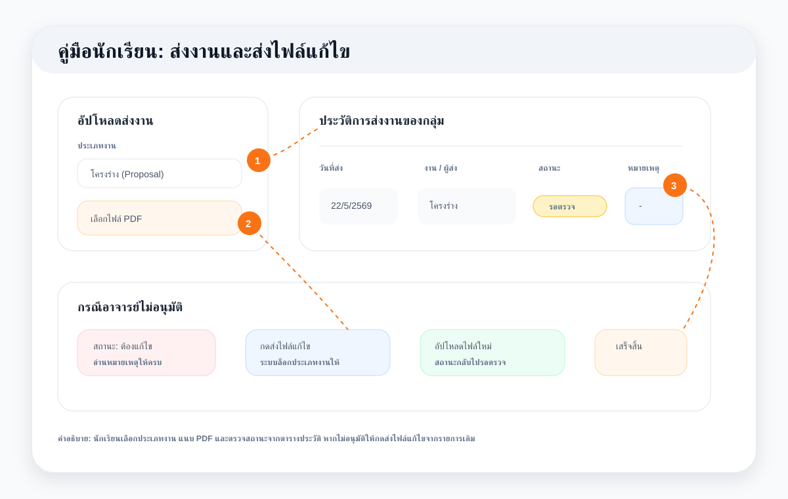
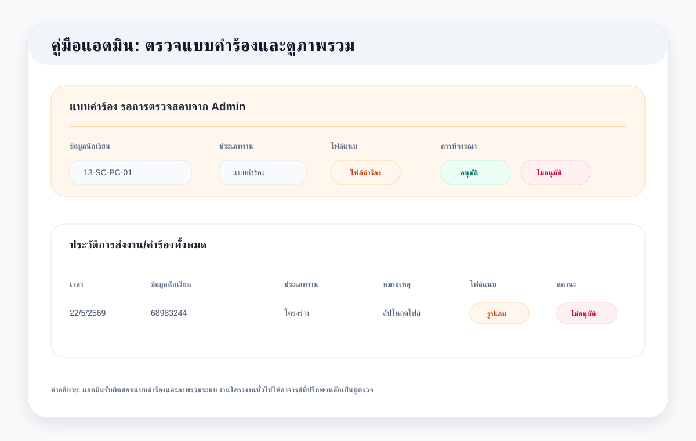

# คู่มือการใช้งานระบบ SCIUSNU SMART

เวอร์ชันคู่มือ: 22 พฤษภาคม 2569  
เว็บไซต์ระบบ: https://sciusnu-smart.vercel.app/

คู่มือนี้แบ่งตามบทบาทผู้ใช้งาน 4 กลุ่ม ได้แก่ นักเรียน อาจารย์ที่ปรึกษาหลัก อาจารย์ที่ปรึกษาร่วม/ที่ปรึกษาโรงเรียน และแอดมิน

## ภาพรวมระบบ

SCIUSNU SMART เป็นระบบติดตามการส่งงานโครงงานของนักเรียน โดยข้อมูลหลักเชื่อมกับ Google Sheet และไฟล์ PDF ถูกจัดเก็บใน Google Drive ผ่าน Google Apps Script

ลำดับการทำงานหลัก:

1. นักเรียนเข้าสู่ระบบ
2. นักเรียนอัปโหลดไฟล์งานหรือแบบคำร้อง
3. ระบบบันทึกข้อมูลลง Google Sheet และแจ้งเตือนผู้เกี่ยวข้อง
4. อาจารย์ที่ปรึกษาหลักตรวจงาน
5. ถ้าอนุมัติ ระบบจะแสดงสถานะอนุมัติ
6. ถ้าไม่อนุมัติ ระบบจะแสดงหมายเหตุให้นักเรียนแก้ไข
7. นักเรียนส่งไฟล์แก้ไขใหม่ ระบบจะคงหมายเหตุเดิมไว้เพื่อให้ตรวจซ้ำได้ถูกต้อง
8. อาจารย์ที่ปรึกษาร่วมและอาจารย์ที่ปรึกษาโรงเรียนสามารถดูสถานะและหมายเหตุได้แบบ Read-Only
9. แอดมินดูแลและอนุมัติรายการแบบคำร้อง

> กรอบอธิบายภาพ: ภาพนี้แสดงเส้นทางหลักของข้อมูล ตั้งแต่ผู้ใช้เข้าสู่ระบบ นักเรียนอัปโหลดไฟล์ ระบบบันทึกลง Google Sheet และ Google Drive จากนั้นอาจารย์ที่ปรึกษาหลักหรือแอดมินเป็นผู้พิจารณาตามประเภทงาน ส่วนอาจารย์ที่ปรึกษาร่วมและที่ปรึกษาโรงเรียนมีสิทธิ์ดูสถานะเท่านั้น

## ความหมายของสถานะ

| สถานะ | ความหมาย | ผู้ดำเนินการถัดไป |
|---|---|---|
| ยังไม่ส่ง | ยังไม่มีไฟล์งานประเภทนั้นในระบบ | นักเรียน |
| รอตรวจ หรือ รออนุมัติ | นักเรียนส่งไฟล์แล้ว รอผู้ตรวจพิจารณา | อาจารย์ที่ปรึกษาหลัก หรือแอดมินกรณีแบบคำร้อง |
| ต้องแก้ไข หรือ ไม่อนุมัติ | ผู้ตรวจไม่อนุมัติ และมีหมายเหตุให้แก้ไข | นักเรียน |
| รอการตรวจอนุมัติ | นักเรียนส่งไฟล์แก้ไขแล้ว รอตรวจอีกครั้ง | อาจารย์ที่ปรึกษาหลัก |
| อนุมัติ หรือ อนุมัติแล้ว | งานผ่านการตรวจแล้ว | ไม่มี |

## คู่มือนักเรียน

> กรอบอธิบายภาพ: นักเรียนใช้งานหลัก 3 ส่วน คือเลือกประเภทงานและแนบไฟล์ PDF ดูสถานะในตารางประวัติ และหากงานไม่อนุมัติให้กดส่งไฟล์แก้ไขจากรายการเดิม ระบบจะล็อกประเภทงานให้ตรงกับรายการที่ต้องแก้ไข

### 1. เข้าสู่ระบบ

1. เปิดเว็บไซต์ https://sciusnu-smart.vercel.app/
2. กรอกรหัสนักเรียนหรืออีเมลนักเรียน
3. กรอกรหัสผ่าน
4. กดปุ่ม `เข้าสู่ระบบ`
5. ระบบจะพาไปที่หน้า `student.html`

ถ้าเข้าสู่ระบบไม่ได้ ให้ตรวจสอบรหัสผ่านใน Google Sheet หรือติดต่อเจ้าหน้าที่โครงการ

### 2. ตรวจสอบข้อมูลโครงงาน

หลังเข้าสู่ระบบ นักเรียนจะเห็นข้อมูลสำคัญ เช่น

- รหัสโครงงาน
- รายชื่อนักเรียนในกลุ่ม
- อาจารย์ที่ปรึกษาหลัก
- อาจารย์ที่ปรึกษาร่วม
- อาจารย์ที่ปรึกษาโรงเรียน
- สถานะงานแต่ละประเภท

หากข้อมูลรายชื่อหรืออาจารย์ไม่ถูกต้อง ต้องแก้ข้อมูลต้นทางใน Google Sheet

### 3. แก้ไขข้อมูลส่วนตัว

1. กดรูปโปรไฟล์หรือปุ่มตั้งค่าบริเวณด้านบน
2. ตรวจสอบหรือแก้ไขข้อมูล เช่น เบอร์โทรศัพท์ รูปโปรไฟล์ หรือรหัสผ่าน
3. กดบันทึก

หมายเหตุ: ระบบอาจบังคับให้นักเรียนกรอกเบอร์โทรศัพท์ก่อนอัปโหลดงาน

### 4. อัปโหลดงานครั้งแรก

1. ไปที่กล่อง `อัปโหลดส่งงาน`
2. เลือก `ประเภทงาน`
3. แนบไฟล์ PDF
4. กด `อัปโหลดส่งงาน`
5. รอระบบแจ้งว่าอัปโหลดสำเร็จ
6. ตรวจสอบรายการในตารางประวัติการส่งงาน

ประเภทงานที่ใช้ในระบบ:

- โครงร่าง (Proposal)
- รายงานความก้าวหน้า
- รายงานฉบับสมบูรณ์
- แบบคำร้อง

### 5. กรณีเพื่อนในกลุ่มส่งงานไปแล้ว

ถ้ามีสมาชิกในกลุ่มส่งงานประเภทเดียวกันไปแล้ว ระบบจะแจ้งเตือนก่อนอัปโหลดซ้ำ

ถ้านักเรียนยืนยันอัปโหลด ไฟล์ใหม่จะถูกใช้แทนไฟล์เดิมของกลุ่ม

### 6. ตรวจสอบสถานะงาน

ดูได้ที่ส่วน `สถานะการส่งงาน` และ `ประวัติการส่งงานของกลุ่ม`

สิ่งที่ต้องดู:

- วันที่ส่ง
- ประเภทงาน
- สถานะ
- หมายเหตุ
- ปุ่มเปิดไฟล์

ถ้าสถานะเป็น `รอตรวจ` หรือ `รออนุมัติ` ให้นักเรียนรอผลจากผู้ตรวจ

### 7. กรณีงานไม่อนุมัติ

เมื่ออาจารย์ไม่อนุมัติ ระบบจะแสดงสถานะ `ต้องแก้ไข` และแสดงข้อความในคอลัมน์ `หมายเหตุ`

ขั้นตอน:

1. อ่านข้อความหมายเหตุจากอาจารย์
2. แก้ไขไฟล์ PDF ตามหมายเหตุ
3. กดปุ่ม `ส่งไฟล์แก้ไข`
4. แนบไฟล์ PDF ฉบับแก้ไข
5. กดอัปโหลด
6. สถานะจะเปลี่ยนเป็น `รอการตรวจอนุมัติ`

หมายเหตุ: เมื่อมีงานที่ต้องแก้ไข ระบบจะล็อกประเภทงานให้ส่งเฉพาะรายการที่ถูกไม่อนุมัติเท่านั้น เพื่อป้องกันการส่งผิดประเภท

### 8. การส่งแบบคำร้อง

1. เลือกประเภทงานเป็น `แบบคำร้อง`
2. แนบไฟล์ PDF แบบคำร้อง
3. กดอัปโหลด
4. ระบบจะส่งรายการให้แอดมินตรวจ

แบบคำร้องจะถูกพิจารณาโดยแอดมิน ไม่ใช่อาจารย์ที่ปรึกษาหลัก

### 9. ออกจากระบบ

กดปุ่ม `ออกระบบ` ด้านบนของหน้าเว็บ

## คู่มืออาจารย์ที่ปรึกษาหลัก

> กรอบอธิบายภาพ: อาจารย์ที่ปรึกษาหลักเปิดไฟล์งานเพื่อตรวจ จากนั้นเลือกอนุมัติหรือไม่อนุมัติ ถ้ากดอนุมัติระบบจะให้ยืนยันอีกครั้ง ถ้ากดไม่อนุมัติระบบจะแสดงช่องให้กรอกหมายเหตุ ซึ่งข้อความนี้จะไปแสดงให้นักเรียนใช้แก้ไขงาน

### 1. เข้าสู่ระบบ

1. เปิดเว็บไซต์ https://sciusnu-smart.vercel.app/
2. กรอกอีเมลอาจารย์ที่ปรึกษาหลัก
3. กรอกรหัสผ่าน
4. กด `เข้าสู่ระบบ`
5. ระบบจะพาไปที่หน้า `advisor.html`

ระบบจะให้สิทธิ์อนุมัติเฉพาะอาจารย์ที่ปรึกษาหลักที่อีเมลตรงกับข้อมูลใน Google Sheet เท่านั้น

### 2. ตรวจสอบภาพรวมสถานะโครงงาน

ในส่วน `ภาพรวมสถานะโครงงานของกลุ่มที่คุณดูแล` จะแสดงรายชื่อกลุ่มที่อาจารย์รับผิดชอบ พร้อมสถานะของงานแต่ละประเภท

สถานะที่ควรตรวจ:

- ยังไม่ส่ง
- รอตรวจ
- ต้องแก้ไข
- อนุมัติ

### 3. ดูประวัติการส่งงานทั้งหมด

ในส่วน `ประวัติการส่งงานทั้งหมด` จะแสดงรายการส่งงานของกลุ่มที่ดูแล

คอลัมน์สำคัญ:

- วันที่ส่ง
- ข้อมูลผู้ส่งและกลุ่ม
- ประเภทงาน
- หมายเหตุ
- สถานะ
- ไฟล์แนบ
- ตรวจงาน

### 4. เปิดไฟล์งาน

1. กดปุ่ม `เปิดไฟล์`
2. ไฟล์จะเปิดในแท็บใหม่
3. หน้าเว็บตรวจงานยังคงอยู่ที่เดิม

ถ้าเปิดไฟล์ไม่ได้ ให้ตรวจสอบสิทธิ์ไฟล์ใน Google Drive หรือปิดตัวบล็อกป๊อปอัปของเบราว์เซอร์

### 5. อนุมัติงาน

1. ไปที่คอลัมน์ `ตรวจงาน`
2. กดปุ่ม `อนุมัติ`
3. ระบบจะแสดงกล่องยืนยัน
4. กด `ยืนยันอนุมัติ`
5. สถานะจะเปลี่ยนเป็น `อนุมัติ`
6. ระบบแจ้งผลให้นักเรียนและผู้เกี่ยวข้อง

### 6. ไม่อนุมัติงาน

1. ไปที่คอลัมน์ `ตรวจงาน`
2. กดปุ่ม `ไม่อนุมัติ`
3. กรอกหมายเหตุที่ต้องการให้นักเรียนแก้ไข
4. กด `ยืนยันไม่อนุมัติ`
5. สถานะจะเปลี่ยนเป็น `ไม่อนุมัติ` หรือ `ต้องแก้ไข`
6. นักเรียนจะเห็นหมายเหตุในหน้าของตนเอง
7. นักเรียนสามารถส่งไฟล์แก้ไขใหม่ได้

ควรเขียนหมายเหตุให้ชัดเจน เช่น

- แก้ไขบทคัดย่อ
- เพิ่มการอ้างอิง
- ปรับรูปแบบตาราง
- แนบไฟล์ผิดฉบับ

### 7. ตรวจไฟล์แก้ไข

เมื่อนักเรียนส่งไฟล์แก้ไข ระบบจะแสดงสถานะ `รอการตรวจอนุมัติ` หรือ `รอตรวจไฟล์แก้ไข`

อาจารย์จะยังเห็นหมายเหตุเดิมที่เคยให้นักเรียนแก้ เพื่อใช้ตรวจซ้ำได้ถูกต้อง

ขั้นตอนเหมือนการตรวจงานปกติ:

1. เปิดไฟล์
2. ตรวจงานตามหมายเหตุเดิม
3. กด `อนุมัติ` ถ้าแก้ครบ
4. กด `ไม่อนุมัติ` และกรอกหมายเหตุใหม่ถ้ายังต้องแก้

### 8. เปลี่ยนรหัสผ่านหรือข้อมูลโปรไฟล์

1. กดรูปโปรไฟล์หรือปุ่มตั้งค่า
2. กรอกรหัสผ่านเดิม
3. กรอกรหัสผ่านใหม่
4. ยืนยันรหัสผ่านใหม่
5. กดบันทึก

### 9. ออกจากระบบ

กดปุ่ม `ออกระบบ`

## คู่มืออาจารย์ที่ปรึกษาร่วม/ที่ปรึกษาโรงเรียน

> กรอบอธิบายภาพ: หน้านี้เป็นสิทธิ์อ่านอย่างเดียว ผู้ใช้สามารถดูสถานะและหมายเหตุจากผู้ตรวจได้ แต่ไม่สามารถกดอนุมัติ ไม่อนุมัติ หรือดาวน์โหลดไฟล์เพื่อตรวจงาน

### 1. เข้าสู่ระบบ

1. เปิดเว็บไซต์ https://sciusnu-smart.vercel.app/
2. กรอกอีเมลอาจารย์ที่ปรึกษาร่วมหรืออาจารย์ที่ปรึกษาโรงเรียน
3. กรอกรหัสผ่าน
4. กด `เข้าสู่ระบบ`
5. ระบบจะพาไปที่หน้า `viewer.html`

### 2. สิทธิ์การใช้งาน

บัญชีนี้เป็นสิทธิ์แบบ Read-Only

สามารถทำได้:

- ดูรายชื่อกลุ่มที่รับผิดชอบ
- ดูสถานะงาน
- ดูหมายเหตุจากอาจารย์ที่ปรึกษาหลัก
- ติดตามความคืบหน้าของนักเรียน

ไม่สามารถทำได้:

- อนุมัติงาน
- ไม่อนุมัติงาน
- ดาวน์โหลดหรือเปิดไฟล์เนื้อหาเพื่อตรวจงาน
- แก้ไขสถานะ

### 3. ดูภาพรวมสถานะโครงงาน

ส่วน `ภาพรวมสถานะโครงงาน` แสดงสถานะของงานแต่ละประเภท เช่น โครงร่าง รายงานความก้าวหน้า และรายงานฉบับสมบูรณ์

### 4. ดูประวัติการส่งงาน

ส่วน `ประวัติการส่งงานทั้งหมด` แสดงรายการส่งงานของกลุ่มที่เกี่ยวข้อง

คอลัมน์สำคัญ:

- วันที่ส่ง
- ข้อมูลผู้ส่งและกลุ่ม
- ประเภทงาน
- หมายเหตุ
- สถานะ

หมายเหตุในตารางจะแสดงเฉพาะข้อความที่อาจารย์ที่ปรึกษาหลักหรือแอดมินบันทึกไว้

### 5. ออกจากระบบ

กดปุ่ม `ออกระบบ`

## คู่มือแอดมิน

> กรอบอธิบายภาพ: แอดมินใช้ตรวจแบบคำร้องและดูภาพรวมรายการส่งงานทั้งหมด โดยแบบคำร้องจะมีปุ่มอนุมัติและไม่อนุมัติ ส่วนงานโครงงานทั่วไปยังคงให้อาจารย์ที่ปรึกษาหลักเป็นผู้ตรวจ

### 1. เข้าสู่ระบบ

1. เปิดเว็บไซต์ https://sciusnu-smart.vercel.app/
2. ใช้บัญชีผู้ดูแลระบบที่โครงการกำหนด
3. กด `เข้าสู่ระบบ`
4. ระบบจะพาไปที่หน้า `admin.html`

เพื่อความปลอดภัย ไม่ควรเผยแพร่รหัสผ่านแอดมินในเอกสารสาธารณะ

### 2. หน้าที่หลักของแอดมิน

แอดมินใช้สำหรับ:

- ดูภาพรวมข้อมูลการส่งงาน
- ตรวจสอบแบบคำร้อง
- อนุมัติหรือไม่อนุมัติแบบคำร้อง
- ดูประวัติการส่งงานทั้งหมด
- ตรวจสอบไฟล์แนบในระบบ

### 3. ตรวจแบบคำร้อง

1. ไปที่ส่วน `แบบคำร้อง รอการตรวจสอบจาก Admin`
2. ตรวจรายชื่อนักเรียนและรหัสโครงงาน
3. กดเปิดไฟล์คำร้อง
4. ถ้าถูกต้อง กด `อนุมัติ`
5. ถ้าไม่ถูกต้อง กด `ไม่อนุมัติ`
6. หากไม่อนุมัติ สามารถกรอกเหตุผลให้ผู้เกี่ยวข้องทราบ

เมื่อแบบคำร้องได้รับอนุมัติ ระบบจะแจ้งไปยังผู้เกี่ยวข้องตามอีเมลที่บันทึกใน Google Sheet

### 4. ดูประวัติการส่งงานทั้งหมด

ในส่วน `ประวัติการส่งงาน/คำร้องทั้งหมด` แอดมินสามารถดูรายการที่ถูกส่งเข้าระบบทั้งหมด

คอลัมน์สำคัญ:

- เวลา
- ข้อมูลนักเรียน
- ประเภทงาน
- หมายเหตุ
- ไฟล์แนบ
- สถานะปัจจุบัน

### 5. การเปิดไฟล์แนบ

ปุ่มไฟล์แนบอาจมี:

- ไฟล์รูปเล่ม
- ไฟล์คำร้อง
- หน้าลายเซ็น

ถ้าไม่มีไฟล์หน้าลายเซ็น ระบบจะไม่แสดงปุ่มหน้าลายเซ็น

### 6. ออกจากระบบ

กดปุ่ม `ออกจากระบบ`

## การดูแลข้อมูลใน Google Sheet

### 1. ชีตข้อมูลนักเรียนและอาจารย์

ชีตแรกของ Google Sheet ใช้เป็นฐานข้อมูลหลักของระบบ

ข้อมูลที่ระบบใช้ เช่น

- E-mail นักเรียน
- รหัสนักเรียน
- ชื่อ
- นามสกุล
- รหัสโครงงาน
- E-mail อาจารย์ที่ปรึกษาหลัก
- ชื่ออาจารย์ที่ปรึกษาหลัก
- E-mail อาจารย์ที่ปรึกษาร่วม
- ชื่ออาจารย์ที่ปรึกษาร่วม
- E-mail อาจารย์ที่ปรึกษาโรงเรียน
- ชื่ออาจารย์ที่ปรึกษาโรงเรียน
- ชื่อโครงงาน
- รหัสผ่าน
- เบอร์โทรศัพท์
- รูปโปรไฟล์

ข้อควรระวัง:

- อีเมลอาจารย์ที่ปรึกษาหลักต้องตรงกับผู้ที่มีสิทธิ์อนุมัติ
- อาจารย์ที่ปรึกษาร่วมและอาจารย์ที่ปรึกษาโรงเรียนจะได้สิทธิ์ดูอย่างเดียว
- ถ้าอีเมลผิด ระบบอาจพาไปผิดหน้า หรือไม่พบข้อมูลโครงงาน

### 2. ชีต Submissions

ระบบจะสร้างชีต `Submissions` อัตโนมัติถ้ายังไม่มี

หัวคอลัมน์ที่ควรมี:

| คอลัมน์ | ความหมาย |
|---|---|
| Timestamp | วันที่และเวลาที่ส่ง |
| รหัสนักเรียน | รหัสผู้ส่ง |
| ชื่อ | ชื่อผู้ส่ง |
| นามสกุล | นามสกุลผู้ส่ง |
| รหัสโครงงาน | รหัสโครงงาน |
| ประเภทงาน | ประเภทงานที่ส่ง |
| URL ไฟล์เล่ม | ลิงก์ไฟล์ PDF |
| URL ลายเซ็น | ลิงก์ไฟล์ลายเซ็น ถ้ามี |
| สถานะ | สถานะปัจจุบัน |
| อ.ที่ปรึกษา | ชื่ออาจารย์ที่ปรึกษา |
| หมายเหตุ | เหตุผลหรือข้อความจากผู้ตรวจ |

ห้ามลบคอลัมน์ `หมายเหตุ` เพราะระบบใช้แสดงเหตุผลให้ทั้งนักเรียนและอาจารย์เห็น

### 3. การแก้ข้อมูลโดยตรงใน Google Sheet

ทำได้ในกรณีจำเป็น เช่น

- แก้อีเมลผิด
- แก้ชื่ออาจารย์ผิด
- แก้รหัสโครงงานผิด
- กู้สถานะที่บันทึกผิด

ข้อควรระวัง:

- ไม่ควรเปลี่ยนชื่อหัวคอลัมน์บ่อย
- ไม่ควรลบชีต `Submissions`
- ไม่ควรลบ URL ไฟล์ถ้ายังต้องใช้ตรวจสอบย้อนหลัง

## การดูแล Google Apps Script

### 1. หลังแก้ Code.gs ต้อง Deploy ใหม่

เมื่อแก้ไข `Code.gs` ให้ทำตามนี้:

1. เปิด Google Apps Script
2. กด `Deploy`
3. เลือก `Manage deployments`
4. กดไอคอนแก้ไข
5. เลือก `New version`
6. กด `Deploy`
7. คัดลอก Web App URL ใหม่
8. นำ URL ใหม่ไปใส่ในไฟล์ HTML ทุกหน้าที่เรียก API

ไฟล์ที่ใช้ URL Apps Script:

- `index.html`
- `student.html`
- `advisor.html`
- `viewer.html`
- `admin.html`

### 2. หลังแก้หน้าเว็บต้อง Push ไป GitHub

เมื่อแก้ไฟล์ HTML:

1. Commit การเปลี่ยนแปลง
2. Push ไปที่ branch `main`
3. รอ Vercel deploy
4. รีเฟรชหน้าเว็บ

โดยทั่วไป Vercel ใช้เวลาประมาณ 1 ถึง 2 นาที

## ปัญหาที่พบบ่อยและวิธีแก้

### 1. นักเรียนส่งไฟล์แล้วหมายเหตุหาย

สาเหตุที่เป็นไปได้:

- Google Apps Script ยังไม่ได้ Deploy เวอร์ชันใหม่
- คอลัมน์ `หมายเหตุ` ในชีต `Submissions` ถูกลบหรือเปลี่ยนชื่อ
- หน้าเว็บยังใช้ Apps Script URL เก่า

วิธีแก้:

1. ตรวจคอลัมน์ `หมายเหตุ`
2. Deploy Apps Script เป็นเวอร์ชันใหม่
3. ตรวจ URL API ในไฟล์ HTML
4. รอ Vercel deploy แล้วรีเฟรชหน้าเว็บ

### 2. อาจารย์ที่ปรึกษาร่วมเข้าไปแล้วอนุมัติได้

สาเหตุที่เป็นไปได้:

- อีเมลถูกบันทึกในคอลัมน์อาจารย์ที่ปรึกษาหลักผิด
- บัญชีถูกระบุ role ผิด
- Google Sheet มีข้อมูลอีเมลซ้ำหรือผิดคอลัมน์

วิธีแก้:

1. ตรวจอีเมลอาจารย์ที่ปรึกษาหลัก
2. ตรวจอีเมลอาจารย์ที่ปรึกษาร่วม
3. ตรวจอีเมลอาจารย์ที่ปรึกษาโรงเรียน
4. ออกจากระบบแล้วเข้าสู่ระบบใหม่

### 3. Viewer เห็นสถานะผิดเป็นอนุมัติแล้ว

สาเหตุเดิมคือการอ่านคำว่า `อนุมัติ` ซ้อนอยู่ในคำว่า `ไม่อนุมัติ`

ระบบแก้ไขแล้วโดยอ่านสถานะแบบแยกชัดเจน:

- ไม่อนุมัติ
- อนุมัติ
- รอตรวจ

ถ้ายังพบปัญหา ให้รีเฟรชหน้าเว็บหลัง Vercel deploy

### 4. เปิดไฟล์ไม่ได้

สาเหตุที่เป็นไปได้:

- เบราว์เซอร์บล็อก pop-up
- ไฟล์ใน Google Drive ไม่มีสิทธิ์เปิด
- URL ไฟล์ใน Google Sheet เสีย

วิธีแก้:

1. อนุญาต pop-up สำหรับเว็บ
2. ตรวจสิทธิ์ไฟล์ใน Google Drive
3. ตรวจ URL ในชีต `Submissions`

### 5. นักเรียนอัปโหลดไม่ได้

ตรวจสอบ:

- เลือกประเภทงานแล้วหรือยัง
- แนบไฟล์ PDF แล้วหรือยัง
- กรอกเบอร์โทรศัพท์แล้วหรือยัง
- ถ้างานถูกไม่อนุมัติ ต้องกด `ส่งไฟล์แก้ไข` จากตารางประวัติ
- ถ้าเป็นงานที่ต้องแก้ ระบบจะล็อกให้ส่งเฉพาะประเภทงานนั้น

### 6. อาจารย์ที่ปรึกษาหลักเข้าแล้วกลายเป็น viewer.html

สาเหตุที่เป็นไปได้:

- อีเมลที่ใช้เข้าสู่ระบบไม่ตรงกับคอลัมน์ E-mail อาจารย์ที่ปรึกษาหลัก
- ชื่อหรืออีเมลใน Google Sheet สะกดต่างจากบัญชีจริง
- ยังใช้ข้อมูลเก่าจาก localStorage

วิธีแก้:

1. ตรวจอีเมลใน Google Sheet
2. กดออกจากระบบ
3. เข้าสู่ระบบใหม่
4. ถ้ายังผิด ให้ล้าง cache หรือเปิด Incognito แล้วลองใหม่

## แนวทางการใช้งานที่แนะนำ

### สำหรับนักเรียน

- ใช้ไฟล์ PDF เท่านั้น
- ตรวจประเภทงานก่อนอัปโหลดทุกครั้ง
- อ่านหมายเหตุจากอาจารย์ให้ครบก่อนส่งไฟล์แก้ไข
- เมื่อส่งไฟล์แก้ไขแล้ว ให้ตรวจว่าสถานะเปลี่ยนเป็น `รอการตรวจอนุมัติ`

### สำหรับอาจารย์ที่ปรึกษาหลัก

- กดเปิดไฟล์ก่อนตัดสินใจ
- ถ้าไม่อนุมัติ ให้เขียนหมายเหตุให้ชัดเจน
- ถ้าเป็นไฟล์แก้ไข ให้เทียบกับหมายเหตุเดิม
- ใช้ปุ่ม `อนุมัติ` และ `ไม่อนุมัติ` ในคอลัมน์ตรวจงาน

### สำหรับอาจารย์ที่ปรึกษาร่วม/ที่ปรึกษาโรงเรียน

- ใช้ระบบเพื่อติดตามสถานะ
- หากพบข้อมูลผิด ให้แจ้งอาจารย์ที่ปรึกษาหลักหรือแอดมิน
- ไม่มีสิทธิ์อนุมัติหรือแก้สถานะงาน

### สำหรับแอดมิน

- ตรวจแบบคำร้องเป็นประจำ
- ตรวจ URL Apps Script หลัง Deploy ทุกครั้ง
- ตรวจว่า Vercel deploy สำเร็จหลัง push
- สำรองข้อมูล Google Sheet เป็นระยะ
