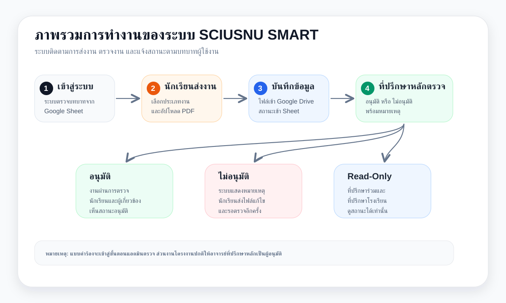
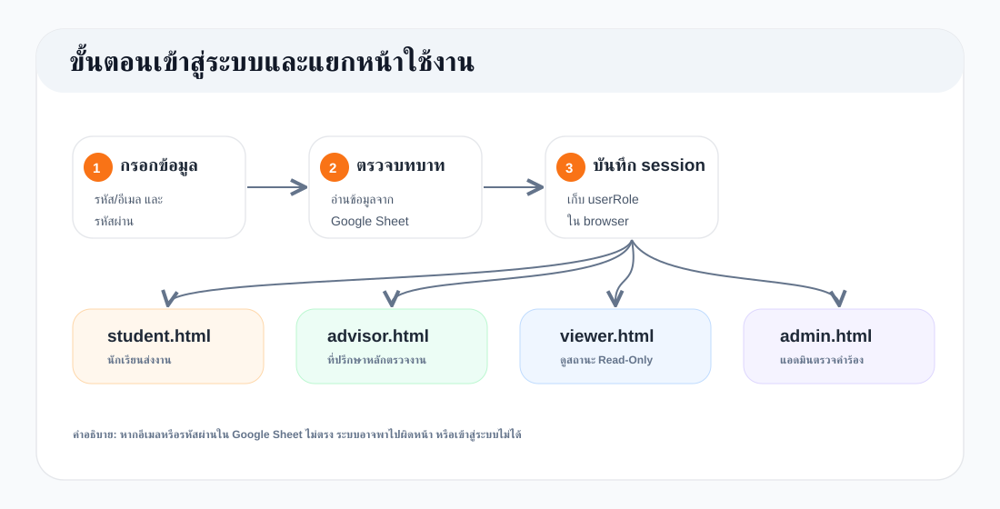
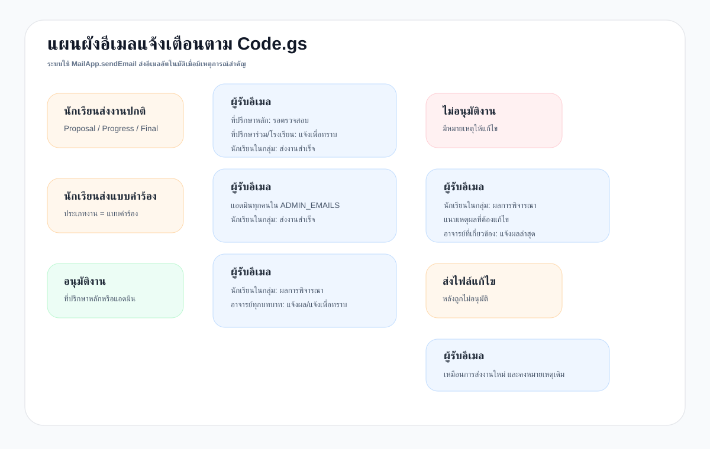
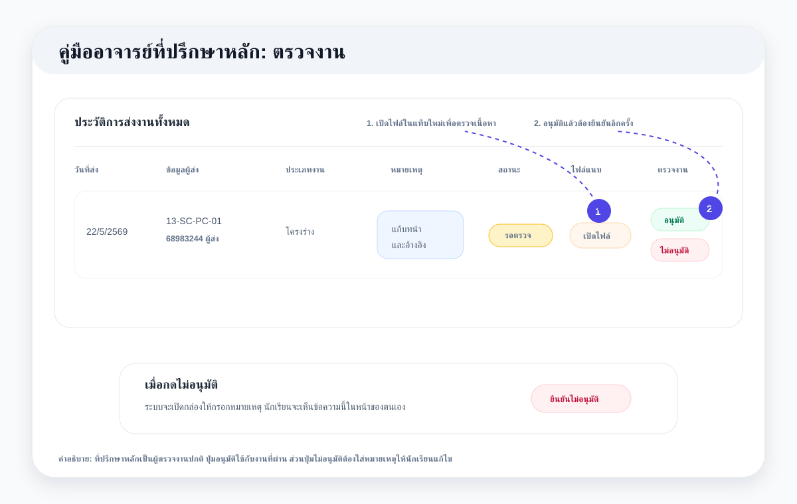
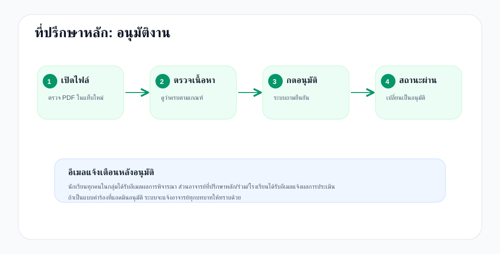
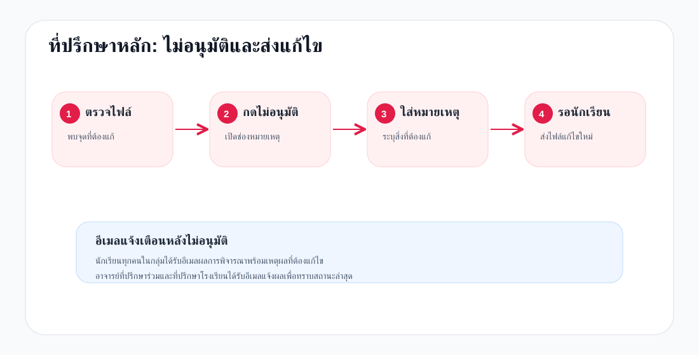
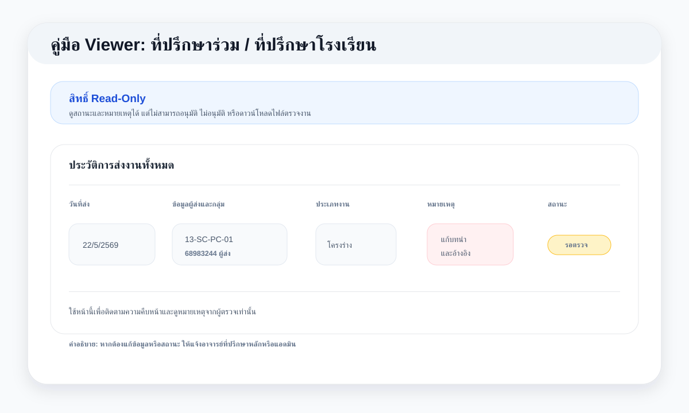

# คู่มือการใช้งานระบบ SCIUSNU SMART

เวอร์ชันคู่มือ: 22 พฤษภาคม 2569  
เว็บไซต์ระบบ: https://sciusnu-smart.vercel.app/

คู่มือนี้แบ่งตามบทบาทผู้ใช้งาน 4 กลุ่ม ได้แก่ นักเรียน อาจารย์ที่ปรึกษาหลัก อาจารย์ที่ปรึกษาร่วม/ที่ปรึกษาโรงเรียน และแอดมิน

## ภาพรวมระบบ

SCIUSNU SMART เป็นระบบติดตามการส่งงานโครงงานของนักเรียน โดยข้อมูลหลักเชื่อมกับ Google Sheet และไฟล์ PDF ถูกจัดเก็บใน Google Drive ผ่าน Google Apps Script

ลำดับการทำงานหลัก:

1. นักเรียนเข้าสู่ระบบ
2. นักเรียนอัปโหลดไฟล์งานหรือแบบคำร้อง
3. ระบบบันทึกข้อมูลลง Google Sheet และแจ้งเตือนผู้เกี่ยวข้อง
4. อาจารย์ที่ปรึกษาหลักตรวจงาน
5. ถ้าอนุมัติ ระบบจะแสดงสถานะอนุมัติ
6. ถ้าไม่อนุมัติ ระบบจะแสดงหมายเหตุให้นักเรียนแก้ไข
7. นักเรียนส่งไฟล์แก้ไขใหม่ ระบบจะคงหมายเหตุเดิมไว้เพื่อให้ตรวจซ้ำได้ถูกต้อง
8. อาจารย์ที่ปรึกษาร่วมและอาจารย์ที่ปรึกษาโรงเรียนสามารถดูสถานะและหมายเหตุได้แบบ Read-Only
9. แอดมินดูแลและอนุมัติรายการแบบคำร้อง

> กรอบอธิบายภาพ: ภาพนี้แสดงเส้นทางหลักของข้อมูล ตั้งแต่ผู้ใช้เข้าสู่ระบบ นักเรียนอัปโหลดไฟล์ ระบบบันทึกลง Google Sheet และ Google Drive จากนั้นอาจารย์ที่ปรึกษาหลักหรือแอดมินเป็นผู้พิจารณาตามประเภทงาน ส่วนอาจารย์ที่ปรึกษาร่วมและที่ปรึกษาโรงเรียนมีสิทธิ์ดูสถานะเท่านั้น

> กรอบอธิบายภาพ: ภาพนี้แสดงขั้นตอนตั้งแต่ผู้ใช้กรอกบัญชีและรหัสผ่าน ระบบอ่านบทบาทจาก Google Sheet แล้วส่งผู้ใช้ไปยังหน้าที่ถูกต้อง นักเรียนไป `student.html` อาจารย์ที่ปรึกษาหลักไป `advisor.html` อาจารย์ที่ปรึกษาร่วม/ที่ปรึกษาโรงเรียนไป `viewer.html` และแอดมินไป `admin.html`

## ความหมายของสถานะ

| สถานะ | ความหมาย | ผู้ดำเนินการถัดไป |
|---|---|---|
| ยังไม่ส่ง | ยังไม่มีไฟล์งานประเภทนั้นในระบบ | นักเรียน |
| รอตรวจ หรือ รออนุมัติ | นักเรียนส่งไฟล์แล้ว รอผู้ตรวจพิจารณา | อาจารย์ที่ปรึกษาหลัก หรือแอดมินกรณีแบบคำร้อง |
| ต้องแก้ไข หรือ ไม่อนุมัติ | ผู้ตรวจไม่อนุมัติ และมีหมายเหตุให้แก้ไข | นักเรียน |
| รอการตรวจอนุมัติ | นักเรียนส่งไฟล์แก้ไขแล้ว รอตรวจอีกครั้ง | อาจารย์ที่ปรึกษาหลัก |
| อนุมัติ หรือ อนุมัติแล้ว | งานผ่านการตรวจแล้ว | ไม่มี |

## ระบบอีเมลแจ้งเตือน

ระบบมีอีเมลแจ้งเตือนทุกครั้งที่มีการส่งงาน ตรวจงาน อนุมัติ ไม่อนุมัติ และส่งไฟล์แก้ไข โดยอ้างอิงการทำงานจาก `Code.gs`

> กรอบอธิบายภาพ: ภาพนี้สรุปว่าเมื่อเกิดเหตุการณ์ในระบบ Google Apps Script จะส่งอีเมลถึงผู้เกี่ยวข้องทันที เช่น นักเรียนส่งงานแล้วแจ้งอาจารย์ที่ปรึกษาหลัก นักเรียนส่งแบบคำร้องแล้วแจ้งแอดมิน และเมื่อมีผลอนุมัติหรือไม่อนุมัติ ระบบจะแจ้งกลับนักเรียนพร้อมหมายเหตุถ้ามี

| เหตุการณ์ | ผู้รับอีเมล | เนื้อหาหลักในอีเมล |
|---|---|---|
| นักเรียนส่งงานปกติ | อาจารย์ที่ปรึกษาหลัก | แจ้งว่ามีงานใหม่รอตรวจสอบ พร้อมรหัสโครงงาน ชื่องาน ประเภทงาน และรายชื่อสมาชิก |
| นักเรียนส่งงานปกติ | อาจารย์ที่ปรึกษาร่วม/ที่ปรึกษาโรงเรียน | แจ้งเพื่อทราบว่านักเรียนส่งงานแล้ว และรออาจารย์ที่ปรึกษาหลักอนุมัติ |
| นักเรียนส่งงานปกติ | นักเรียนทุกคนในกลุ่ม | ยืนยันว่าระบบรับไฟล์แล้ว พร้อมชื่อผู้ส่งและรายละเอียดโครงงาน |
| นักเรียนส่งแบบคำร้อง | แอดมินทุกคนใน `ADMIN_EMAILS` | แจ้งว่ามีแบบคำร้องใหม่รอตรวจสอบในหน้าแอดมิน |
| นักเรียนส่งแบบคำร้อง | นักเรียนทุกคนในกลุ่ม | ยืนยันว่าระบบรับไฟล์แบบคำร้องแล้ว |
| ผู้ตรวจกดอนุมัติ | นักเรียนทุกคนในกลุ่ม | แจ้งผลการพิจารณาว่าอนุมัติแล้ว |
| ผู้ตรวจกดไม่อนุมัติ | นักเรียนทุกคนในกลุ่ม | แจ้งผลว่าไม่อนุมัติ พร้อมหมายเหตุที่ต้องแก้ไข |
| อาจารย์ที่ปรึกษาหลักตรวจงานปกติ | อาจารย์ที่ปรึกษาหลัก/ร่วม/โรงเรียน | แจ้งผลการประเมินงานโครงงานให้ผู้เกี่ยวข้องทราบ |
| แอดมินอนุมัติแบบคำร้อง | อาจารย์ที่ปรึกษาหลัก/ร่วม/โรงเรียน | แจ้งเพื่อทราบว่าแบบคำร้องของกลุ่มได้รับอนุมัติแล้ว |
| นักเรียนส่งไฟล์แก้ไข | อาจารย์ที่ปรึกษาหลัก นักเรียน และผู้เกี่ยวข้อง | ใช้เส้นทางแจ้งเตือนเหมือนการส่งงานปกติ โดยสถานะกลับไปรอการตรวจอนุมัติ และยังคงแสดงหมายเหตุเดิมให้ตรวจย้อนกลับได้ |

## คู่มืออาจารย์ที่ปรึกษาหลัก

> กรอบอธิบายภาพ: อาจารย์ที่ปรึกษาหลักเปิดไฟล์งานเพื่อตรวจ จากนั้นเลือกอนุมัติหรือไม่อนุมัติ ถ้ากดอนุมัติระบบจะให้ยืนยันอีกครั้ง ถ้ากดไม่อนุมัติระบบจะแสดงช่องให้กรอกหมายเหตุ ซึ่งข้อความนี้จะไปแสดงให้นักเรียนใช้แก้ไขงาน

### 1. เข้าสู่ระบบ

1. เปิดเว็บไซต์ https://sciusnu-smart.vercel.app/
2. กรอกอีเมลอาจารย์ที่ปรึกษาหลัก
3. กรอกรหัสผ่าน
4. กด `เข้าสู่ระบบ`
5. ระบบจะพาไปที่หน้า `advisor.html`

ระบบจะให้สิทธิ์อนุมัติเฉพาะอาจารย์ที่ปรึกษาหลักที่อีเมลตรงกับข้อมูลใน Google Sheet เท่านั้น

### 2. ตรวจสอบภาพรวมสถานะโครงงาน

ในส่วน `ภาพรวมสถานะโครงงานของกลุ่มที่คุณดูแล` จะแสดงรายชื่อกลุ่มที่อาจารย์รับผิดชอบ พร้อมสถานะของงานแต่ละประเภท

สถานะที่ควรตรวจ:

- ยังไม่ส่ง
- รอตรวจ
- ต้องแก้ไข
- อนุมัติ

### 3. ดูประวัติการส่งงานทั้งหมด

ในส่วน `ประวัติการส่งงานทั้งหมด` จะแสดงรายการส่งงานของกลุ่มที่ดูแล

คอลัมน์สำคัญ:

- วันที่ส่ง
- ข้อมูลผู้ส่งและกลุ่ม
- ประเภทงาน
- หมายเหตุ
- สถานะ
- ไฟล์แนบ
- ตรวจงาน

### 4. เปิดไฟล์งาน

1. กดปุ่ม `เปิดไฟล์`
2. ไฟล์จะเปิดในแท็บใหม่
3. หน้าเว็บตรวจงานยังคงอยู่ที่เดิม

ถ้าเปิดไฟล์ไม่ได้ ให้ตรวจสอบสิทธิ์ไฟล์ใน Google Drive หรือปิดตัวบล็อกป๊อปอัปของเบราว์เซอร์

### 5. อนุมัติงาน

> กรอบอธิบายภาพ: ภาพนี้แสดงการอนุมัติแบบปลอดภัย อาจารย์เปิดไฟล์ในแท็บใหม่ ตรวจไฟล์โดยหน้าเว็บยังอยู่ที่เดิม จากนั้นกด `อนุมัติ` ระบบจะแสดงกล่องยืนยันอีกครั้งก่อนบันทึกสถานะและส่งอีเมลแจ้งผล

1. ไปที่คอลัมน์ `ตรวจงาน`
2. กดปุ่ม `อนุมัติ`
3. ระบบจะแสดงกล่องยืนยัน
4. กด `ยืนยันอนุมัติ`
5. สถานะจะเปลี่ยนเป็น `อนุมัติ`
6. ระบบแจ้งผลให้นักเรียนและผู้เกี่ยวข้อง

### 6. ไม่อนุมัติงาน

> กรอบอธิบายภาพ: ภาพนี้แสดงการไม่อนุมัติ อาจารย์กด `ไม่อนุมัติ` แล้วกรอกหมายเหตุที่ต้องการให้นักเรียนแก้ไข ระบบจะบันทึกหมายเหตุไว้ในประวัติ แสดงให้นักเรียนเห็น และส่งอีเมลแจ้งเหตุผลกลับไปยังนักเรียน

1. ไปที่คอลัมน์ `ตรวจงาน`
2. กดปุ่ม `ไม่อนุมัติ`
3. กรอกหมายเหตุที่ต้องการให้นักเรียนแก้ไข
4. กด `ยืนยันไม่อนุมัติ`
5. สถานะจะเปลี่ยนเป็น `ไม่อนุมัติ` หรือ `ต้องแก้ไข`
6. นักเรียนจะเห็นหมายเหตุในหน้าของตนเอง
7. นักเรียนสามารถส่งไฟล์แก้ไขใหม่ได้

ควรเขียนหมายเหตุให้ชัดเจน เช่น

- แก้ไขบทคัดย่อ
- เพิ่มการอ้างอิง
- ปรับรูปแบบตาราง
- แนบไฟล์ผิดฉบับ

### 7. ตรวจไฟล์แก้ไข

เมื่อนักเรียนส่งไฟล์แก้ไข ระบบจะแสดงสถานะ `รอการตรวจอนุมัติ` หรือ `รอตรวจไฟล์แก้ไข`

อาจารย์จะยังเห็นหมายเหตุเดิมที่เคยให้นักเรียนแก้ เพื่อใช้ตรวจซ้ำได้ถูกต้อง

ขั้นตอนเหมือนการตรวจงานปกติ:

1. เปิดไฟล์
2. ตรวจงานตามหมายเหตุเดิม
3. กด `อนุมัติ` ถ้าแก้ครบ
4. กด `ไม่อนุมัติ` และกรอกหมายเหตุใหม่ถ้ายังต้องแก้

### 8. เปลี่ยนรหัสผ่านหรือข้อมูลโปรไฟล์

1. กดรูปโปรไฟล์หรือปุ่มตั้งค่า
2. กรอกรหัสผ่านเดิม
3. กรอกรหัสผ่านใหม่
4. ยืนยันรหัสผ่านใหม่
5. กดบันทึก

### 9. ออกจากระบบ

กดปุ่ม `ออกระบบ`

## คู่มืออาจารย์ที่ปรึกษาร่วม/ที่ปรึกษาโรงเรียน

> กรอบอธิบายภาพ: หน้านี้เป็นสิทธิ์อ่านอย่างเดียว ผู้ใช้สามารถดูสถานะและหมายเหตุจากผู้ตรวจได้ แต่ไม่สามารถกดอนุมัติ ไม่อนุมัติ หรือดาวน์โหลดไฟล์เพื่อตรวจงาน

### 1. เข้าสู่ระบบ

1. เปิดเว็บไซต์ https://sciusnu-smart.vercel.app/
2. กรอกอีเมลอาจารย์ที่ปรึกษาร่วมหรืออาจารย์ที่ปรึกษาโรงเรียน
3. กรอกรหัสผ่าน
4. กด `เข้าสู่ระบบ`
5. ระบบจะพาไปที่หน้า `viewer.html`

### 2. สิทธิ์การใช้งาน

บัญชีนี้เป็นสิทธิ์แบบ Read-Only

สามารถทำได้:

- ดูรายชื่อกลุ่มที่รับผิดชอบ
- ดูสถานะงาน
- ดูหมายเหตุจากอาจารย์ที่ปรึกษาหลัก
- ติดตามความคืบหน้าของนักเรียน

ไม่สามารถทำได้:

- อนุมัติงาน
- ไม่อนุมัติงาน
- ดาวน์โหลดหรือเปิดไฟล์เนื้อหาเพื่อตรวจงาน
- แก้ไขสถานะ

### 3. ดูภาพรวมสถานะโครงงาน

ส่วน `ภาพรวมสถานะโครงงาน` แสดงสถานะของงานแต่ละประเภท เช่น โครงร่าง รายงานความก้าวหน้า และรายงานฉบับสมบูรณ์

### 4. ดูประวัติการส่งงาน

ส่วน `ประวัติการส่งงานทั้งหมด` แสดงรายการส่งงานของกลุ่มที่เกี่ยวข้อง

คอลัมน์สำคัญ:

- วันที่ส่ง
- ข้อมูลผู้ส่งและกลุ่ม
- ประเภทงาน
- หมายเหตุ
- สถานะ

หมายเหตุในตารางจะแสดงเฉพาะข้อความที่อาจารย์ที่ปรึกษาหลักหรือแอดมินบันทึกไว้

### 5. ออกจากระบบ

กดปุ่ม `ออกระบบ`

